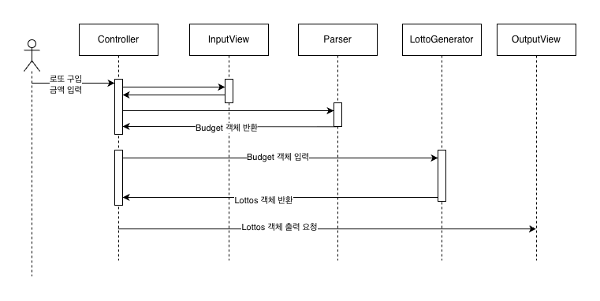
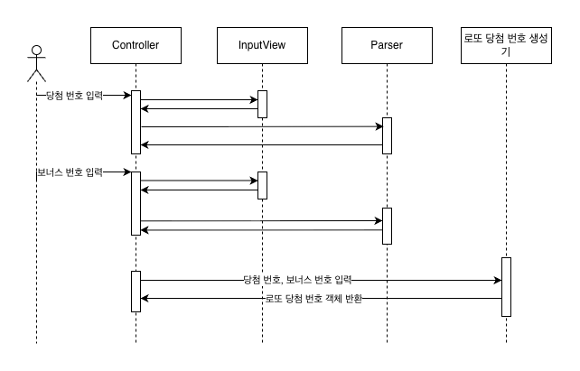
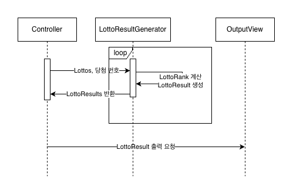

# 로또
우아한 테크코스 3주차 과제이다. 간단한 로또 발매기를 구현한다.

# 기능 요구 사항
- 로또 번호의 숫자 범위는 1~45까지이다.
- 1개의 로또를 발행할 때 중복되지 않는 6개의 숫자를 뽑는다.
- 당첨 번호 추첨 시 중복되지 않는 숫자 6개와 보너스 번호 1개를 뽑는다.
- 당첨은 1등부터 5등까지 있다. 당첨 기준과 금액은 아래와 같다.
  - 1등: 6개 번호 일치 / 2,000,000,000원
  - 2등: 5개 번호 + 보너스 번호 일치 / 30,000,000원
  - 3등: 5개 번호 일치 / 1,500,000원
  - 4등: 4개 번호 일치 / 50,000원
  - 5등: 3개 번호 일치 / 5,000원
- 로또 구입 금액을 입력하면 구입 금액에 해당하는 만큼 로또를 발행해야 한다.
- 로또 1장의 가격은 1,000원이다.
- 당첨 번호와 보너스 번호를 입력받는다.
- 사용자가 구매한 로또 번호와 당첨 번호를 비교하여 당첨 내역 및 수익률을 출력하고 로또 게임을 종료한다.
- 사용자가 잘못된 값을 입력할 경우 IllegalArgumentException을 발생시키고, "[ERROR]"로 시작하는 에러 메시지를 출력 후 그 부분부터 입력을 다시 받는다.
  - Exception이 아닌 IllegalArgumentException, IllegalStateException 등과 같은 명확한 유형을 처리한다.

# 입출력 요구 사항
## 입력
- 로또 구입 금액을 입력 받는다. 구입 금액은 1,000원 단위로 입력 받으며 1,000원으로 나누어 떨어지지 않는 경우 예외 처리한다.
- 당첨 번호를 입력 받는다. 번호는 쉼표(,)를 기준으로 구분한다.
- 보너스 번호를 입력 받는다.
## 출력
- 발행한 로또 수량 및 번호를 출력한다. 로또 번호는 오름차순으로 정렬하여 보여준다.
- 당첨 내역을 출력한다.
- 수익률은 소수점 둘째 자리에서 반올림한다. (ex. 100.0%, 51.5%, 1,000,000.0%)
- 예외 상황 시 에러 문구를 출력해야 한다. 단, 에러 문구는 "[ERROR]"로 시작해야 한다.
## 예시
```
구입금액을 입력해 주세요.
8000

8개를 구매했습니다.
[8, 21, 23, 41, 42, 43]
[3, 5, 11, 16, 32, 38]
[7, 11, 16, 35, 36, 44]
[1, 8, 11, 31, 41, 42]
[13, 14, 16, 38, 42, 45]
[7, 11, 30, 40, 42, 43]
[2, 13, 22, 32, 38, 45]
[1, 3, 5, 14, 22, 45]

당첨 번호를 입력해 주세요.
1,2,3,4,5,6

보너스 번호를 입력해 주세요.
7

당첨 통계
---
3개 일치 (5,000원) - 1개
4개 일치 (50,000원) - 0개
5개 일치 (1,500,000원) - 0개
5개 일치, 보너스 볼 일치 (30,000,000원) - 0개
6개 일치 (2,000,000,000원) - 0개
총 수익률은 62.5%입니다.
```
# 시퀀스 다이어그램
## 로또 구입 금액 입력

## 당첨 번호, 보너스 번호 입력

## 로또 결과 생성 및 출력


# 구현할 기능
## 프로세스 흐름 제어
- 입력 -> 로또 구매 -> 당첨 번호 입력 -> 로또 결과 확인 -> 당첨금 계산 -> 출력

## 의존성 주입
- 의존성 주입

## 입출력
### 입력 담당
- 로또 구입 금액 입력
- 당첨 번호 입력
- 보너스 번호 입력
### 출력 담당
- 발행한 로또 수량과 번호 출력
- 당첨 내역 출력
- 수익률 출력

## 로또
### 로또 발행
- 당첨 번호 저장
### 번호 매칭
- 당첨 번호와 구매한 로또 번호를 비교
### 당첨금 계산
- 당첨된 로또 번호에 따라 당첨금 계산
- 수익률 계산

## 기타
### 랜덤 숫자 생성기
- 0부터 45 사이의 번호를 생성
### 계산기
- 덧셈 연산
- 곱셈 연산
- 퍼센트 연산
### 입력 파싱
- 사용자 입력으로 돈 객체 생성
- 당첨 번호와 보너스 번호로 로또 당첨 번호 객체 생성

# 예외 케이스
## 입력값 오류
- 구입 금액
  - 숫자 이외의 다른 문자가 입력됨
  - 음수거나 0임
  - 1000의 배수가 아님
- 당첨 번호
  - 숫자, 쉼표 이외의 다른 문자가 입력됨
  - 구분자로 구분된 수가 6개가 아님
  - 구분자로 구분된 수가 1~45 사이가 아님
  - 번호가 중복됨
- 보너스 번호
  - 숫자 이외의 다른 문자가 입력됨
  - 1~45 사이가 아님
  - 당첨 번호와 중복됨

# 프로젝트 구조
controller
- LottoController
domain
- Lotto
  - Lotto
  - Lottos
- vo
  - Budget
- message
  - ErrorMessage
  - ViewMessage
- constants
  - Constants
util
- RandomNumberGenerator
- Calculator
- Parser
view
- InputView
- OutputView
